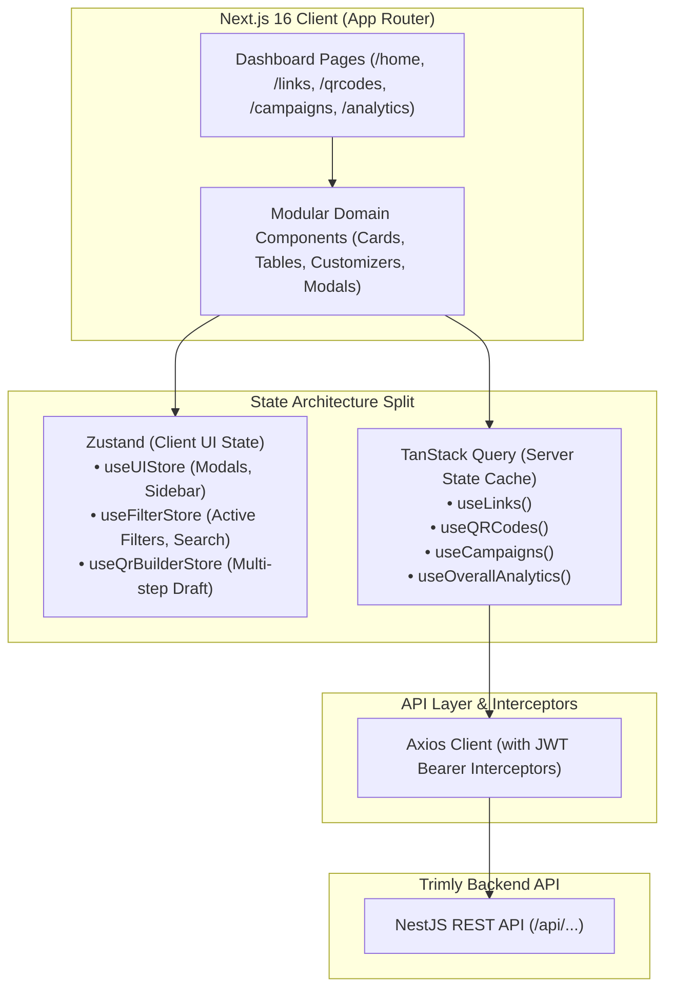

# Trimly Frontend

> A modern, responsive web application for link management, custom QR code generation, marketing campaign tracking, and real-time click analytics — built with Next.js 16 (App Router), React 19, TanStack Query, Zustand, and Tailwind CSS.

[](https://nextjs.org/)
[](https://react.dev/)
[](https://www.typescriptlang.org/)
[](https://tailwindcss.com/)
[](https://tanstack.com/query)
[](https://zustand-demo.pmnd.rs/)
[](https://recharts.org/)
[](https://jestjs.io/)
[](https://opensource.org/licenses/MIT)


**Backend Repository**: [Trimly Backend (NestJS / MongoDB / Redis / BullMQ)](https://github.com/sandeep-kumar-21/trimly-backend)

---

## Table of Contents

- [About the Project](#about-the-project)
- [Key Features](#key-features)
- [Tech Stack](#tech-stack)
- [Engineering Highlights](#engineering-highlights)
- [Architecture & State Management](#architecture--state-management)
- [Screenshots & UI Preview](#screenshots--ui-preview)
- [Project Structure](#project-structure)
- [Getting Started](#getting-started)
  - [Prerequisites](#prerequisites)
  - [Installation](#installation)
  - [Environment Variables](#environment-variables)
  - [Running Locally](#running-locally)
  - [Testing](#testing)
- [Deployment](#deployment)
- [Contributing](#contributing)
- [License](#license)
- [Author & Contact](#author--contact)

---

## About the Project

**Trimly Frontend** is an intuitive, enterprise-grade link management dashboard inspired by Bitly's modern user experience. Built with **Next.js 16 (App Router)** and **React 19**, the client demonstrates clean component decomposition, strict separation between remote server cache and local client state, resilient error boundaries, and server-authoritative vector rendering.

Rather than relying on monolithic page scripts or bloated global Redux stores, Trimly divides state management cleanly: **TanStack Query** manages server cache invalidations and optimistic mutations, while **Zustand** stores lightweight, volatile UI state (modal overlays, drawer toggles, active filter criteria, and multi-step builder drafts).

Trimly is designed around **four core pillars**:
1. **Links**: Lightning-fast URL shortening with custom back-halves, tag assignment, UTM parameters, password gating, bulk actions, and multi-criteria filtering.
2. **QR Codes**: Interactive 2-step customization studio featuring live contrast validation, pattern selection, center logos, and direct server-rendered SVG/PNG/JPEG exports.
3. **Campaigns**: Multi-channel marketing campaign builder with live link aggregation, channel-specific distribution metrics (Email, Social, SMS, Ads), and click attribution.
4. **Analytics**: Real-time engagement analytics dashboards featuring Recharts time-series graphs, top referrer breakdowns, device distributions, and geographic telemetry.

---

## Key Features

### 🔗 Link Management Dashboard
- **Quick Create Bar**: Instant URL shortening from any dashboard view with clipboard auto-copy.
- **Custom Back-Half Aliases & Clones**: Seamlessly edit or duplicate existing links to new custom slugs with preserved metadata.
- **Multi-Factor Filtering & Search**: Instant filtering by tags, custom vs auto aliases, expiration status, attached QR presence, date ranges, and full-text keyword search.
- **Bulk Operations Toolbar**: Batch-select multiple links to add tags, remove tags, or bulk-hide/unhide in a single click.
- **Password-Protected Link Access**: Dedicated `/protected/[code]` unlocking gateway that verifies encrypted links and automatically routes to destination URLs.

### 🎨 Custom QR Code Studio
- **2-Step Creation Flow**: Step 1 captures destination URL & title; Step 2 unlocks rich design customization (dot matrix styles, corner eyes, custom hex colors, center brand logos).
- **Live Scannability & Contrast Warning**: Real-time WCAG contrast computation alerting users if foreground/background colors are unscannable before saving.
- **Server-Authoritative Vector SVG Rendering**: Display exact backend-generated SVG markup across cards, preview modals, and detail pages to prevent client/server drift.
- **Multi-Format Export Engine**: One-click downloads for vector **SVG**, high-resolution **PNG** (1000x1000px), or white-padded **JPEG**.
- **Promote Standalone QRs to Links**: One-click action to promote standalone QR codes into visible dashboard links without recreating target URLs.

### 📁 Marketing Campaigns & Multi-Channel Attribution
- **Dedicated Campaign Creation Studio (`/campaigns/create`)**: Immersive 2-column builder layout featuring real-time input synchronization and auto-collapsing sidebar for maximum workspace canvas.
- **Interactive Live Laptop Mockup**: Live desktop preview reacting instantly to campaign titles, channel selections, and destination URLs with dynamic channel brand dots and in-mockup scrolling.
- **Smart "All Channels" Batch Generation**: Auto-generates multi-channel short links with automatic UTM parameters (`utm_source={channel}&utm_medium=campaign&utm_campaign={name}`) in one click.
- **Multi-Select Inline Card Assignment**: Sleek multi-select drawers within channel cards enabling fast, batch assignment with selection counters, "Clear selection" shortcuts, and batch safety caps.
- **Dynamic Channel Theming & Badges**: Channel cards dynamically theme according to channel types (Social &rarr; Indigo, Email &rarr; Sky Blue, SMS &rarr; Emerald, Paid &rarr; Amber, YouTube &rarr; Red, LinkedIn &rarr; Blue) with dynamic top-performer badges and gold trophy highlights.
- **Safe Unlinking Architecture**: Campaign deletion safely unlinks associated short links without deleting them, keeping live links active in the wild.

### 📈 Visual Analytics & Insights
- **Interactive Time-Series Charts**: Smooth area/line charts built with Recharts displaying daily engagement over 7d/30d/90d windows.
- **Metric Breakdown Cards**: Visual distribution bars for top referring domains, device categories (Desktop/Mobile/Tablet), and countries.
- **Top Performer Badges**: Instant callouts for peak traffic day and top geographic source.

### ⚙️ Account Management & Settings
- **User Profile Customization**: Update display name, avatar URL, theme preferences (light/dark/system), and timezones.
- **Asynchronous Data Export**: Trigger BullMQ data export and poll status with instant JSON download upon completion.
- **Asynchronous Account Deletion**: Password-confirmed background account and data cascade purge.

---

## Tech Stack

| Layer | Technology | Purpose |
| :--- | :--- | :--- |
| **Framework** | [Next.js 16](https://nextjs.org/) (App Router) | React framework with fast client routing, server-rendered layouts, and static optimization |
| **UI Library** | [React 19](https://react.dev/) | Component runtime with hooks, concurrency, and modern rendering |
| **Styling** | [Tailwind CSS 4](https://tailwindcss.com/) | High-performance utility-first styling with native dark mode support |
| **Server State Management**| [TanStack Query 5](https://tanstack.com/query) | Remote API fetching, caching, deduplication, and declarative query invalidation |
| **Client State Management**| [Zustand 5](https://zustand-demo.pmnd.rs/) | Minimalist, boilerplate-free store for modals, drawers, filters, and step drafts |
| **Forms & Validation** | [React Hook Form](https://react-hook-form.com/) / [Zod](https://zod.dev/) | Type-safe form validation and schema parsing with zero unnecessary re-renders |
| **Charts & Visualization**| [Recharts 3](https://recharts.org/) | Responsive SVG charting engine for time-series analytics and breakdown bars |
| **HTTP Client** | [Axios 1](https://axios-http.com/) | Centralized HTTP client with JWT interceptors, base URL configuration, and error handling |
| **Icons** | [Lucide React](https://lucide.dev/) | Clean, consistent SVG icon set matching modern enterprise UI patterns |
| **Notifications** | [Sonner 2](https://sonner.emilkowal.ski/) | Beautiful, stacked toast notifications for async feedback |
| **QR Generation (Preview)**| [qr-code-styling](https://github.com/qr-code-styling/qr-code-styling) | Canvas/SVG preview generation during draft customization |
| **Testing** | [Jest 30](https://jestjs.io/) / [Testing Library](https://testing-library.com/) | Unit testing and component integration testing |

---

## Engineering Highlights

### 1. TanStack Query for All Server State
- **The Problem**: Handling server data with manual `useEffect`, `useState`, and loading/error flags produces verbose boilerplate, race conditions, stale cache synchronization bugs, and excessive network requests.
- **The Solution**: All communication with the Trimly Backend API is wrapped in custom TanStack Query hooks (`useLinks`, `useQRCodes`, `useCampaigns`, `useOverallAnalytics`).
- **Coordinated Query Invalidation**: Mutating operations trigger cross-domain cache invalidations:
  - Creating a link invalidates `['links']` and `['campaigns']` (updating link counts and campaign click rollups).
  - Creating a QR code invalidates both `['qrcodes']` and `['links']` (updating the `hasQR` badge across both views).
  - Deleting a campaign automatically invalidates both `['campaigns']` and `['links']`.

### 2. Zustand for Client-Only UI State (Deliberate Separation from Server State)
- **The Problem**: Storing server responses and transient client state (active modals, sidebar collapse, draft steps, active tag filters) in a single monolithic Redux store leads to duplicate state, complex serialization, and boilerplate actions.
- **The Solution**: Trimly strictly partitions state ownership:
  - **TanStack Query** exclusively owns all server state (API responses, cache, loading states).
  - **Zustand** stores (`useUIStore`, `useFilterStore`, `useQrBuilderStore`) exclusively own purely local, volatile UI state (active modal drawers, multi-step draft configs, multi-select checkboxes).
  - This architecture completely eliminates state duplication and makes components trivial to test in isolation.

### 3. Server-Authoritative QR Rendering
- **The Problem**: If the frontend attempts to independently render a saved QR code using a client-side library, minor rendering variations (e.g. margin differences, rounding errors, corner radius calculations) cause client/server drift between what the user previewed, what is shown on cards, and what is downloaded.
- **The Solution**: Trimly treats the backend as the single source of truth for QR generation. When a QR is saved, the backend stores the vector SVG string and returns it in the API response. The frontend renders this exact SVG via normalized `dangerouslySetInnerHTML` with unique SVG element ID scoping (`id="pattern_${shortCode}"`) to avoid DOM gradient conflicts.
- **Pixel-Identical Guarantee**: The card thumbnail, details view, and downloaded SVG/PNG are mathematically identical.

### 4. Modular Component Architecture
- **The Problem**: Complex dashboard pages often degenerate into 1,000+ line monolithic files mixing layout, API calls, modal logic, and table rendering.
- **The Solution**: Every major domain follows a strict single-responsibility structure:
  - `components/links/`: `LinkCard`, `LinkCardActions`, `LinkSelectionBar`, `LinksSearchBar`, `FilterModal`, `DateFilterModal`.
  - `components/qrcodes/`: `QrCodeCard`, `QrCustomizerCard`, `QrCodePreviewCard`, `QrColorPickerGroup`.
  - `components/campaigns/`: `CampaignList`, `CampaignDetailsFormCard`, `CampaignPreviewCard`, `ChannelBreakdown`.
  - `components/details/`: Shared, reusable detail page layout (`SharedDetailsPageLayout`, `SharedDetailsTitleBar`, `SharedDetailsSharingCard`, `SharedDetailsMetricsModule`).

---

## Architecture & State Management



---

## Screenshots & UI Preview

| Dashboard Home | Links Management |
| :---: | :---: |
| <!-- TODO: add screenshot: Dashboard Home View --> *(Home metrics, quick create bar, and onboarding stepper)* | <!-- TODO: add screenshot: Links Management View --> *(Links list with tag filters, copy button, and bulk action bar)* |

| QR Code Studio | Marketing Campaigns |
| :---: | :---: |
| <!-- TODO: add screenshot: QR Code Customizer --> *(Live QR pattern customizer with real-time contrast validation)* | <!-- TODO: add screenshot: Campaigns Studio --> *(Campaign creation studio with channel-level attribution)* |

| Analytics & Insights | Account Settings |
| :---: | :---: |
| <!-- TODO: add screenshot: Analytics Overview --> *(Recharts engagement trends, referrers, devices, & country maps)* | <!-- TODO: add screenshot: Account Settings --> *(User preferences, data export polling, & account security)* |

---

## Project Structure

```text
trimly-frontend/
├── src/
│   ├── app/                                                 # Next.js App Router (pages, layouts, and API routes)
│   │   ├── (auth)/                                          # Unauthenticated authentication layout & pages
│   │   │   ├── login/                                       # Sign-in route
│   │   │   │   └── page.tsx                                 # Login view with email/password authentication
│   │   │   ├── register/                                    # Account registration route
│   │   │   │   └── page.tsx                                 # User sign-up view with form validation
│   │   │   └── layout.tsx                                   # Centered authentication shell layout
│   │   ├── (dashboard)/                                     # Authenticated application dashboard routes
│   │   │   ├── analytics/                                   # Real-time analytics dashboards
│   │   │   │   └── page.tsx                                 # Analytics time-series & breakdown dashboard view
│   │   │   ├── campaigns/                                   # Marketing campaign management & attribution
│   │   │   │   ├── [id]/                                    # Single campaign detail & channel breakdown
│   │   │   │   │   └── page.tsx                             # Channel link performance & campaign overview
│   │   │   │   └── page.tsx                                 # Campaigns landing, 2-column builder, & list view
│   │   │   ├── home/                                        # Dashboard home overview
│   │   │   │   └── page.tsx                                 # Quick create bar, aggregate stats, & onboarding checklist
│   │   │   ├── links/                                       # Short URL management & filtering
│   │   │   │   ├── [code]/                                  # Link dynamic routes
│   │   │   │   │   ├── details/                             # Comprehensive link metadata & share view
│   │   │   │   │   │   └── page.tsx                         # Link details, metrics summary, & sharing card
│   │   │   │   │   ├── edit/                                # Link configuration editing view
│   │   │   │   │   │   └── page.tsx                         # Edit target destination, tags, & expiration
│   │   │   │   │   └── page.tsx                             # Link root redirect handler
│   │   │   │   ├── create/                                  # Full-page short link creation studio
│   │   │   │   │   └── page.tsx                             # 2-column creation interface with live preview
│   │   │   │   └── page.tsx                                 # Primary links list, multi-factor search, & bulk toolbar
│   │   │   ├── qrcodes/                                     # Custom QR code studio & management
│   │   │   │   ├── [code]/                                  # QR code dynamic routes
│   │   │   │   │   ├── details/                             # QR code detail overview
│   │   │   │   │   │   └── page.tsx                         # High-res preview, direct downloads, & scan metrics
│   │   │   │   │   ├── edit/                                # QR code edit routes
│   │   │   │   │   │   ├── customize/                       # Visual QR pattern & palette customizer
│   │   │   │   │   │   │   └── page.tsx                     # Interactive studio for dots, corners, colors, & logo
│   │   │   │   │   │   └── page.tsx                         # Edit QR target destination and backing URL
│   │   │   │   │   └── page.tsx                             # QR root dynamic route handler
│   │   │   │   ├── create/                                  # 2-step QR generation wizard
│   │   │   │   │   └── page.tsx                             # Step 1 destination setup & Step 2 visual customizer
│   │   │   │   ├── new/                                     # Quick new QR alias redirect
│   │   │   │   │   └── page.tsx                             # Creation route forwarder
│   │   │   │   └── page.tsx                                 # QR codes list and gallery view
│   │   │   ├── settings/                                    # User preferences, data export, & security
│   │   │   │   └── page.tsx                                 # Profile, appearance, GDPR data export, & account purge
│   │   │   └── layout.tsx                                   # Authenticated dashboard layout with sidebar & topbar
│   │   ├── [code]/                                          # Direct frontend short URL resolver route
│   │   │   └── route.ts                                     # Client-side 302 redirect handler
│   │   ├── protected/[code]/                                # Encrypted link password challenge gateway
│   │   │   └── page.tsx                                     # Rate-limited password entry & unlocking view
│   │   ├── s/qrc_preview/                                   # Standalone QR code preview landing page
│   │   │   └── page.tsx                                     # Unbranded preview renderer
│   │   ├── globals.css                                      # Tailwind CSS 4 directives, design tokens, & styles
│   │   ├── layout.tsx                                       # Root HTML layout with Geist font configuration
│   │   ├── page.tsx                                         # Landing page routing directly to /home
│   │   └── providers.tsx                                    # TanStack QueryClientProvider & Sonner toast provider
│   ├── components/                                          # Domain-driven modular React components
│   │   ├── analytics/                                       # Analytics visualization components
│   │   │   ├── ClicksLineChart.tsx                          # Recharts responsive area/line engagement chart
│   │   │   ├── CountryBreakdown.tsx                         # Geographic country distribution list
│   │   │   ├── DateRangeFilter.tsx                          # Preset date range selector (7d, 30d, 90d)
│   │   │   ├── DeviceBreakdown.tsx                          # Device platform distribution breakdown
│   │   │   ├── ReferrerBreakdown.tsx                        # Referring domains and sources breakdown
│   │   │   ├── StatCard.tsx                                 # Reusable KPI summary metric card
│   │   │   └── TopMetricsCards.tsx                          # Top performing day and top country badge cards
│   │   ├── auth/                                            # Authentication forms
│   │   │   ├── LoginForm.tsx                                # Sign-in form with validation and error alerts
│   │   │   └── RegisterForm.tsx                             # Account creation form with password requirements
│   │   ├── campaigns/                                       # Marketing campaign components
│   │   │   ├── CampaignActionBar.tsx                        # Sticky submit & cancel action bar
│   │   │   ├── CampaignCard.tsx                             # Campaign summary card with total link/click stats
│   │   │   ├── CampaignCreationHeader.tsx                   # Stepper breadcrumb header for campaign creation
│   │   │   ├── CampaignDetailsFormCard.tsx                  # 2-column form card for campaign details & channels
│   │   │   ├── CampaignList.tsx                             # Grid/list of active user marketing campaigns
│   │   │   ├── CampaignPreviewCard.tsx                      # Real-time reactive preview card for campaign draft
│   │   │   ├── CampaignsLanding.tsx                         # Empty state hero introducing campaigns feature
│   │   │   ├── ChannelBreakdown.tsx                         # Multi-channel link attribution table and breakdown
│   │   │   └── CreateCampaignModal.tsx                      # Quick campaign creation modal dialog
│   │   ├── creation/                                        # Shared 2-column creation suite
│   │   │   ├── SharedAdvancedSettingsCard.tsx               # Password protection, custom alias, & UTM parameters
│   │   │   ├── SharedCreationActionBar.tsx                  # Common bottom action bar for multi-step creation
│   │   │   ├── SharedDetailsCard.tsx                        # Destination URL, title, and tag assignment card
│   │   │   ├── SharedEditForm.tsx                           # Universal entity editor form
│   │   │   └── SharedSharingOptionsCard.tsx                 # Campaign and channel assignment card
│   │   ├── details/                                         # Shared entity details view components
│   │   │   ├── SharedDetailsInfoCard.tsx                    # Detailed metadata card (creation date, target URL)
│   │   │   ├── SharedDetailsMetricsModule.tsx               # Embedded scan/click engagement metrics module
│   │   │   ├── SharedDetailsPageLayout.tsx                  # 2-column layout wrapper for link/QR detail views
│   │   │   ├── SharedDetailsSharingCard.tsx                 # Server-authoritative QR display and sharing options
│   │   │   ├── SharedDetailsTitleBar.tsx                    # Header with inline editable title, tags, and actions
│   │   │   └── SharedDynamicRoutingCard.tsx                 # Dynamic destination routing configuration card
│   │   ├── home/                                            # Dashboard home view widgets
│   │   │   ├── AiAssistSidePanel.tsx                        # AI assistant slide-out panel
│   │   │   └── DoMoreChecklist.tsx                          # Interactive onboarding milestone checklist
│   │   ├── icons/                                           # Custom branded SVGs
│   │   │   └── AppIcons.tsx                                 # Trimly custom vector icon definitions
│   │   ├── layout/                                          # Application layout shell
│   │   │   ├── DashboardShell.tsx                           # Responsive desktop/mobile application frame
│   │   │   ├── NotificationCenterDropdown.tsx               # In-app notification tray dropdown
│   │   │   ├── Sidebar.tsx                                  # Collapsible sidebar with navigation items
│   │   │   ├── SidebarNavItem.tsx                           # Active route indicator navigation item
│   │   │   └── Topbar.tsx                                   # Header with global create button and profile menu
│   │   ├── links/                                           # Links management components
│   │   │   ├── create/                                      # Link creation specific components
│   │   │   │   ├── LinkAdvancedSettingsCard.tsx             # Link password, back-half, and UTM settings
│   │   │   │   ├── LinkCreateActionBar.tsx                  # Link creation save/cancel action bar
│   │   │   │   └── LinkDetailsCard.tsx                      # Link destination URL and title input
│   │   │   │   └── LinkSharingOptionsCard.tsx               # Link campaign channel association
│   │   │   ├── CopyLinkButton.tsx                           # Clipboard copy button with animated confirmation
│   │   │   ├── CreateLinkModal.tsx                          # Quick create link modal dialog
│   │   │   ├── DateFilterModal.tsx                          # Modal dialog for custom date range filtering
│   │   │   ├── EmptyLinksState.tsx                          # Empty state graphic and call-to-action
│   │   │   ├── FilterModal.tsx                              # Multi-criteria filter modal (tags, type, expiration)
│   │   │   ├── LinkActionsMenu.tsx                          # Overflow dropdown menu for link card actions
│   │   │   ├── LinkCard.tsx                                 # Rich link card with copy, tag pills, and metrics
│   │   │   ├── LinkCardActions.tsx                          # Quick action buttons (edit, QR, hide, delete)
│   │   │   ├── LinkRow.tsx                                  # Compact row view representation of a link
│   │   │   ├── LinkSearchInput.tsx                          # Search input with clear button
│   │   │   ├── LinkSelectionBar.tsx                         # Bulk actions toolbar (tag, hide, delete selected)
│   │   │   ├── LinksHeader.tsx                              # Links page title and create button header
│   │   │   ├── LinksPageFooter.tsx                          # Pagination and footer metadata
│   │   │   ├── LinksPagePromoBanner.tsx                     # Upgrade/feature promotional card
│   │   │   ├── LinksSearchBar.tsx                           # Search, filter pills, and date trigger toolbar
│   │   │   ├── LinkTable.tsx                                # Tabular data presentation for links
│   │   │   ├── QuickCreateBar.tsx                           # Instant link shortener bar on dashboard home
│   │   │   ├── TagInput.tsx                                 # Autocomplete chip tag input component
│   │   │   └── TriStateTagPicker.tsx                        # Tri-state tag filtering and selection component
│   │   ├── modals/                                          # Application-wide modal dialogs
│   │   │   ├── DeleteConfirmModal.tsx                       # Destructive action confirmation modal
│   │   │   ├── HideModal.tsx                                # Entity archive/hide confirmation modal
│   │   │   ├── ResetDraftModal.tsx                          # Discard unsaved customizer draft modal
│   │   │   ├── ShareModal.tsx                               # Social sharing and QR export modal
│   │   │   ├── UnsavedChangesModal.tsx                      # Navigation guard warning for unsaved changes
│   │   │   └── WhatToCreateModal.tsx                        # Selection dialog for Link vs QR vs Campaign
│   │   ├── qrcodes/                                         # QR Studio components
│   │   │   ├── AdvancedSettingsCard.tsx                     # QR error correction and back-half configuration
│   │   │   ├── CodeDetailsCard.tsx                          # QR title and target destination input card
│   │   │   ├── FloatingActionBar.tsx                        # Floating save toolbar for mobile customizer
│   │   │   ├── QrCodeCard.tsx                               # QR card with server SVG rendering and downloads
│   │   │   ├── QrCodeLanding.tsx                            # QR Studio introductory empty state hero
│   │   │   ├── QrCodePreviewCard.tsx                        # Live reactive preview card with contrast warning
│   │   │   ├── QrCodesHeader.tsx                            # QR page title and creation trigger header
│   │   │   ├── QrCodesList.tsx                              # Gallery list of all customized user QR codes
│   │   │   ├── QrCodesPageFooter.tsx                        # QR gallery pagination and footer info
│   │   │   ├── QrCodesSearchBar.tsx                         # Search and filter bar for QR gallery
│   │   │   ├── QrCodesSelectionBar.tsx                      # Bulk selection toolbar for QR codes
│   │   │   ├── QrCodeStepperHeader.tsx                      # 2-step visual wizard progress header
│   │   │   ├── QrColorPickerGroup.tsx                       # Color palette presets and hex inputs
│   │   │   ├── QrCustomizerCard.tsx                         # Pattern, corner eye, and logo selection card
│   │   │   └── SharingOptionsCard.tsx                       # QR campaign and channel association card
│   │   ├── settings/                                        # Account settings and profile management
│   │   │   ├── profile/                                     # Profile sub-sections
│   │   │   │   ├── ProfilePreferencesSection.tsx            # Theme, timezone, and notification preferences
│   │   │   │   ├── ProfileSarAndAccountSection.tsx          # GDPR data export and account purge triggers
│   │   │   │   └── ProfileSecuritySection.tsx               # Password change and authentication settings
│   │   │   ├── AccountDetailsTab.tsx                        # Account overview and email status tab
│   │   │   ├── ProfileSettingsTab.tsx                       # User profile display name & avatar tab
│   │   │   ├── SettingsContentPanel.tsx                     # Container card for settings tabs
│   │   │   ├── SettingsSidebar.tsx                          # Vertical tab navigation for settings
│   │   │   └── UsersTab.tsx                                 # Team members and access management tab
│   │   ├── shared/                                          # Shared cross-cutting components
│   │   │   ├── ConfirmDialog.tsx                            # Generic confirmation dialog wrapper
│   │   │   ├── LoadingSkeleton.tsx                          # Content placeholder skeleton animations
│   │   │   ├── Pagination.tsx                               # Page pagination controls
│   │   │   ├── QRCodeGenerator.tsx                          # Client-side canvas/SVG generator for drafts
│   │   │   ├── SharedPageHeader.tsx                         # Standardized page title and action bar header
│   │   │   └── SharedSearchBar.tsx                          # Standardized search input with filter triggers
│   │   └── ui/                                              # Atomic UI primitives
│   │       ├── Badge.tsx                                    # Colored status and category badge
│   │       ├── Button.tsx                                   # Button with variant, size, and loading states
│   │       ├── CustomSelect.tsx                             # Accessible custom dropdown select
│   │       ├── Dropdown.tsx                                 # Generic popover dropdown menu
│   │       ├── Input.tsx                                    # Form text input with floating labels
│   │       ├── Modal.tsx                                    # Accessible modal overlay dialog wrapper
│   │       ├── Spinner.tsx                                  # SVG loading spinner indicator
│   │       ├── Toast.tsx                                    # Toast notification styling template
│   │       └── Tooltip.tsx                                  # Hover tooltip popup component
│   ├── hooks/                                               # Custom React & TanStack Query hooks
│   │   ├── useAuth.ts                                       # Authentication state, login, and registration
│   │   ├── useBulkLinks.ts                                  # Bulk tagging and hiding mutation hooks
│   │   ├── useCampaignDetails.ts                            # Single campaign aggregation query hook
│   │   ├── useCampaigns.ts                                  # Campaigns CRUD query and mutation hooks
│   │   ├── useCreateLink.ts                                 # Link creation mutation hook with auto-copy toast
│   │   ├── useDataExport.ts                                 # Asynchronous GDPR data export polling hook
│   │   ├── useLinkAnalytics.ts                              # Single short URL analytics query hook
│   │   ├── useLinks.ts                                      # Links query with active filters & mutations
│   │   ├── useOverallAnalytics.ts                           # Global account analytics metrics query hook
│   │   ├── useProfile.ts                                    # User profile, password, and preference mutations
│   │   ├── useQRCodes.ts                                    # QR codes query, duplication, and SVG fetch hooks
│   │   ├── useTags.ts                                       # User distinct tags query hook
│   │   └── useVerifyLinkAccess.ts                           # Password verification query hook for protected URLs
│   ├── lib/                                                 # Core libraries, API clients, and utilities
│   │   ├── api/                                             # API service modules
│   │   │   ├── analytics.api.ts                             # Analytics API endpoints
│   │   │   ├── auth.api.ts                                  # Authentication API endpoints
│   │   │   ├── campaigns.api.ts                             # Campaigns API endpoints
│   │   │   ├── client.ts                                    # Axios instance with Bearer token interceptor
│   │   │   ├── links.api.ts                                 # Links CRUD and bulk operations API endpoints
│   │   │   ├── qrcodes.api.ts                               # QR codes CRUD and binary blob fetch endpoints
│   │   │   └── users.api.ts                                 # Profile, export, and account deletion endpoints
│   │   ├── data/                                            # Static and fallback data
│   │   │   └── analyticsDummyData.ts                        # Sample analytics data for preview states
│   │   ├── utils/                                           # Helper utility functions
│   │   │   ├── cn.ts                                        # Tailwind class merging utility (clsx + twMerge)
│   │   │   ├── formatDate.ts                                # Timestamp and date string formatting
│   │   │   ├── formatNumber.ts                              # Number formatting with abbreviations (e.g. 1.2k)
│   │   │   ├── qrConfigMapper.ts                            # Form pattern mapper to QRCodeStyling properties
│   │   │   └── qrContrastValidator.ts                       # WCAG luminance contrast calculation for QR codes
│   │   └── validators/                                      # Zod schema definitions
│   │       ├── auth.schema.ts                               # Login and registration validation schemas
│   │       ├── campaign.schema.ts                           # Campaign creation validation schema
│   │       ├── link.schema.ts                               # Short link creation validation schema
│   │       └── profile.schema.ts                            # Profile update validation schema
│   ├── store/                                               # Zustand client state stores
│   │   ├── filterStore.ts                                   # Active search, filter criteria, and selections
│   │   ├── qrBuilderStore.ts                                # 2-step QR draft customization state store
│   │   └── uiStore.ts                                       # Active modals, sidebar collapse, & UI overlays
│   ├── types/                                               # TypeScript interfaces and declarations
│   │   ├── analytics.types.ts                               # Analytics metrics, breakdowns, and time-series types
│   │   ├── campaign.types.ts                                # Campaign, channel stats, and link relation types
│   │   ├── jest-dom.d.ts                                    # Testing library DOM matcher types
│   │   ├── link.types.ts                                    # Short link, payload, and filter option types
│   │   └── user.types.ts                                    # User profile, preferences, and session types
│   └── __tests__/                                           # Jest and React Testing Library test suites
│       ├── ClicksLineChart.test.tsx                         # Recharts component unit tests
│       ├── CreateLinkModal.test.tsx                         # Link modal creation flow tests
│       ├── LinkCardActions.test.tsx                         # Link card action button tests
│       ├── LinkTable.test.tsx                               # Link table rendering tests
│       ├── LoginForm.test.tsx                               # Login form validation and submit tests
│       ├── ProtectedCodePage.test.tsx                       # Password protected page unlock tests
│       ├── QrCodeRenderSeparation.test.tsx                  # Server SVG authoritative rendering unit tests
│       ├── QrColorPickerGroup.test.tsx                      # QR color palette picker tests
│       ├── WhatToCreateModal.test.tsx                       # Creation modal navigation tests
│       └── zustandStores.test.ts                            # Zustand store state transition unit tests
├── public/                                                  # Public static assets & images
│   ├── images/                                              # Static graphics and icons
│   │   └── icons/                                           # Pattern and corner preview SVG assets (c1-c7, p1-p7)
│   ├── s/                                                   # Standalone static pages
│   │   └── qrc_preview.html                                 # Unbranded QR scannability test landing page
│   ├── Campaigns_image.webp                                 # Marketing campaigns illustration asset
│   ├── qrcode_image.webp                                    # QR Studio illustration asset
│   ├── trimly-logo.svg                                      # Trimly full brand logo
│   └── trimly-logo-only.svg                                 # Trimly icon-only logo mark
├── .env.example                                             # Environment template
├── .gitignore                                               # Git ignore rules for node_modules and .next
├── AGENTS.md                                                # Development instructions for AI agents
├── CLAUDE.md                                                # Development workflow notes
├── eslint.config.mjs                                        # ESLint Next.js configuration
├── jest.config.js                                           # Jest test runner configuration
├── jest.setup.js                                            # Testing library setup and DOM mocks
├── next.config.ts                                           # Next.js configuration
├── package.json                                             # NPM dependencies, scripts, and package metadata
├── postcss.config.mjs                                       # PostCSS configuration for Tailwind CSS
└── tsconfig.json                                            # TypeScript compiler options
```

---

## Getting Started

### Prerequisites

- **Node.js**: `v20.x` or `v22.x` (LTS recommended)
- **Package Manager**: `npm` (v10+)
- **Backend API**: Running instance of [Trimly Backend](../trimly-backend) (local or deployed)

### Installation

1. **Clone the repository**:
   ```bash
   git clone https://github.com/your-username/trimly-frontend.git
   cd trimly-frontend
   ```

2. **Install dependencies**:
   ```bash
   npm install
   ```

3. **Configure environment variables**:
   ```bash
   cp .env.example .env.local
   ```

### Environment Variables

| Variable | Description | Default / Example |
| :--- | :--- | :--- |
| `NEXT_PUBLIC_API_URL` | Base REST API URL of the Trimly Backend | `http://localhost:4000/api` |

### Running Locally

```bash
# Start Next.js development server
npm run dev

# Build production bundle
npm run build

# Start production server
npm run start

# Run ESLint validation
npm run lint
```

Open [http://localhost:3000](http://localhost:3000) in your browser to view the application.

### Testing

```bash
# Run unit and component integration tests with Jest
npm run test
```

---

## Deployment

Trimly Frontend is optimized for seamless deployment on **Vercel**:

1. **Import Repository**: Connect your GitHub repository to Vercel.
2. **Framework Preset**: Next.js (automatically detected).
3. **Environment Variables**:
   - Set `NEXT_PUBLIC_API_URL` to your production backend URL (e.g. `https://trimly-backend.onrender.com/api`).
4. **Deploy**: Vercel automatically builds and optimizes your static and dynamic routes.

---

## Contributing

Contributions, issues, and feature requests are welcome!

1. Fork the repository
2. Create your feature branch (`git checkout -b feature/amazing-ui-enhancement`)
3. Commit your changes (`git commit -m 'feat: Add amazing UI enhancement'`)
4. Push to the branch (`git push origin feature/amazing-ui-enhancement`)
5. Open a Pull Request

---

## License

Distributed under the MIT License. See [LICENSE](LICENSE) for more information.

---

## Author & Contact

**Sandeep Kumar**  
- **LinkedIn**: [sandeep-kumar-s21](https://www.linkedin.com/in/sandeep-kumar-s21)
- **GitHub**: [sandeep-kumar-21](https://github.com/sandeep-kumar-21)

*Trimly was designed and built as a full-stack portfolio demonstration of production-grade modern frontend architecture, state separation, and real-time dashboard engineering.*
